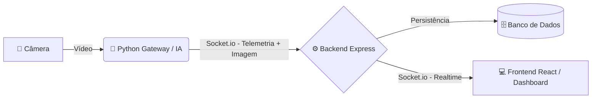

# SIDEL - Sistema Inteligente de Detecção de Lotação


O **SIDEL** é uma solução desenvolvida para monitorar, detectar e alertar sobre a superlotação em lugares em tempo real. Utilizando Inteligência Artificial, o sistema transforma o limite de carga teórico em uma barreira de segurança ativa, prevenindo acidentes, desgastes mecânicos e riscos operacionais.

---

## 📋 Sobre o Projeto

A superlotação em elevadores é uma **condição insegura** que viola normas técnicas e expõe usuários a riscos. Este projeto foi desenvolvido no âmbito do curso técnico em Informática, integrando conhecimentos de **Programação Web II** com os princípios de **Higiene e Segurança do Trabalho (HST)**.

### Principais Funcionalidades
* 👁️ **Visão Computacional:** Contagem de pessoas em tempo real usando Roboflow.
* ⚡ **Processamento Local (Edge):** Gateway inteligente que processa o vídeo localmente e envia apenas telemetria.
* 🚀 **Alertas Imediatos:** Comunicação via WebSocket para notificar a central instantaneamente.
* 📊 **Dashboard de Gestão:** Painel Web para visualização do stream e histórico de ocorrências.

---

## 🏗️ Arquitetura do Sistema

O projeto opera em estrutura de **Monorepo**, dividido em três serviços principais interconectados via rede:



### Estrutura de Pastas

* **`📂 /python` (O Vigilante):** Gateway local. Captura o vídeo da câmera, roda o modelo de IA para detecção de pessoas e transmite os dados processados.
* **`📂 /backend` (O Servidor):** API em Node.js/Express. Gerencia as conexões Socket.io, processa regras de negócio (limites de lotação) e integra com o banco de dados.
* **`📂 /frontend` (O Painel):** Interface Web em React.js. Exibe o monitoramento ao vivo e os alertas visuais para o supervisor.

---

## 🛠️ Tecnologias Utilizadas

### 🐍 Python (Inteligência Artificial)

* **Roboflow:** Plataforma que facilita o uso de modelos de detecção de objetos.
* **OpenCV:** Manipulação e processamento de imagem.
* **Socket.io Client:** Para comunicação em tempo real com o servidor.

### ⚙️ Backend (Servidor)

* **Node.js & Express:** Framework da API.
* **Socket.io:** Websockets para comunicação bidirecional de baixa latência.
* **MongoDB:** Banco de dados para registro de incidentes.

### ⚛️ Frontend (Dashboard)

* **React.js:** Biblioteca para construção da interface.
* **Vite:** Tooling para frontend rápido.
* **Socket.io Client:** Para receber o stream e alertas.

---

## 🚀 Como Rodar o Projeto

Como é um monorepo, você precisará de três terminais abertos.

### Pré-requisitos

* Node.js instalado.
* Python **3.12** instalado.
* Uma Webcam.

### Passo 1: Configurar o Backend

```bash
cd backend
npm install
# Configure o .env antes!
# Inicie o servidor (padrão porta 8080)
node .

```

### Passo 2: Configurar a IA (Python)

Recomendado usar um ambiente virtual (`venv`).

```bash
cd python
# Crie e ative o ambiente virtual
python -m venv venv
source venv/bin/activate # (Linux/Mac) ou .\venv\Scripts\activate (Windows)

# Instale as dependências
pip install -r requirements.txt

# Configure o .env antes!
# Inicie a IA
python main.py

```

### Passo 3: Configurar o Frontend

```bash
cd frontend
npm install
# Inicie o React (padrão porta 5173)
npm run dev

```

---

## ⚙️ Configuração (.env)

Certifique-se de criar arquivos `.env` nas pastas correspondentes se necessário.

**Exemplo `/python/.env`:**

```env
ROBOFLOW_API_KEY=chave-api-roboflow
SOCKET_SERVER_URL=url-do-backend

```

**Exemplo `/backend/.env`:**

```env
URI_MONGODB_CONNECTION=connection-string-do-mongo
JWT_SECRET=super-secreto
PORT=8080

```

---

# 🤝 Contribuição e Autores

Projeto desenvolvido pela equipe **BenTech** do Ensino Médio Técnico Integrado em Informática.

* [Brenda Mônica](https://github.com/brwndag)
* [Ismael Nascimento](https://github.com/ismaelnascimento)
* [João Gabriel Aguiar](https://github.com/Jot4g3)
* [Kauã Sousa](https://github.com/kkauaon)
* [Yasmin Sousa](https://github.com/Yasmin-Sousa)

---
